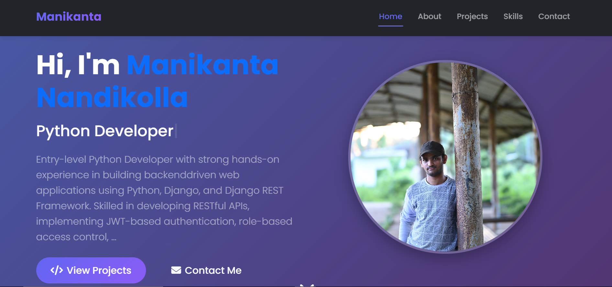
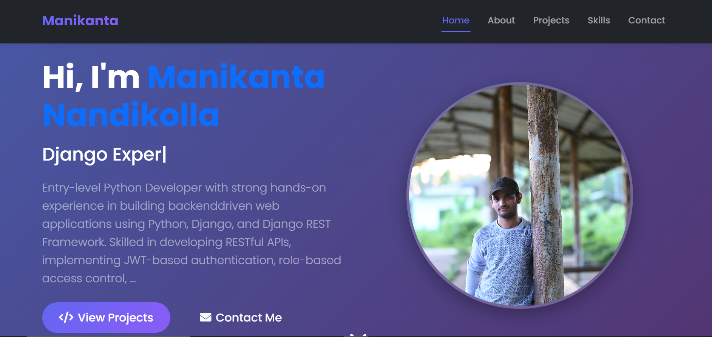
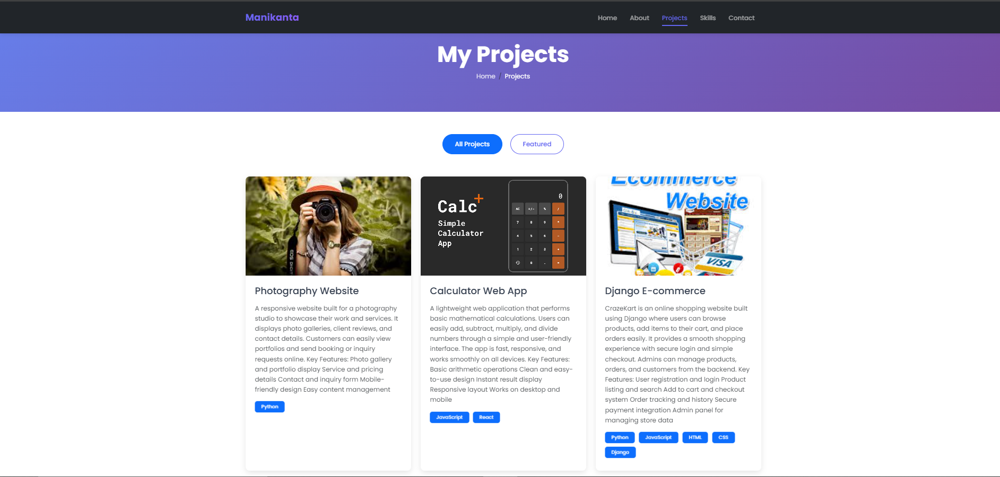
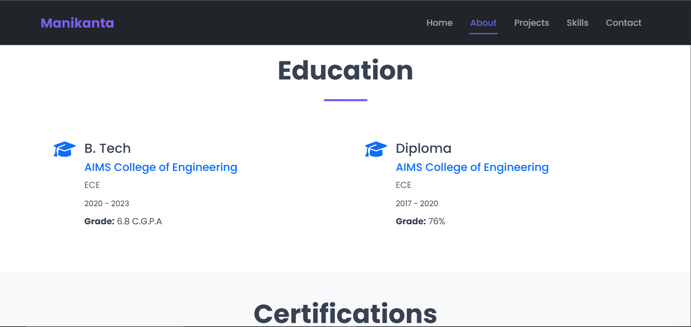
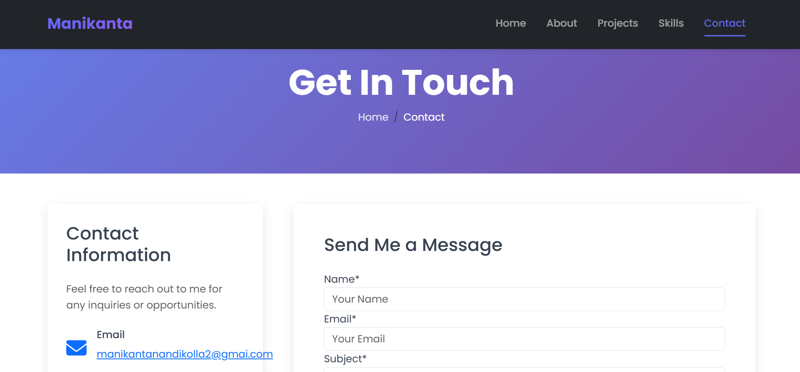
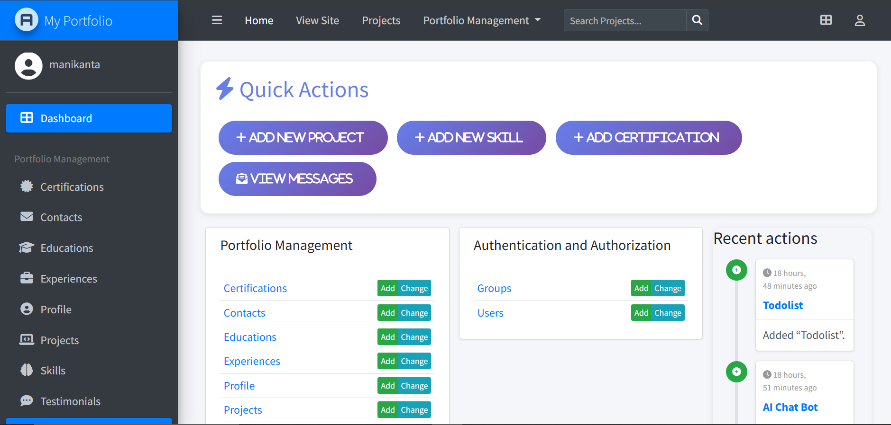

<div align="center">

# 🌟 Dynamic Portfolio Website

### A Stunning, Feature-Rich Portfolio Built with Django

[](https://www.djangoproject.com/)
[](https://www.python.org/)
[](LICENSE)
[](https://www.docker.com/)
[](http://makeapullrequest.com)

[Live Demo](https://your-portfolio-url.com) • [Documentation](#documentation) • [Report Bug](https://github.com/manikanta-nandikolla/Personal_portfolio/issues) • [Request Feature](https://github.com/manikanta-nandikolla/Personal_portfolio/issues)



</div>

---

## 📋 Table of Contents

- [✨ Features](#-features)
- [🎯 Why This Portfolio?](#-why-this-portfolio)
- [🖼️ Screenshots](#️-screenshots)
- [🚀 Quick Start](#-quick-start)
- [🐳 Docker Deployment](#-docker-deployment)
- [🛠️ Tech Stack](#️-tech-stack)
- [📁 Project Structure](#-project-structure)
- [⚙️ Configuration](#️-configuration)
- [📚 Documentation](#-documentation)
- [🤝 Contributing](#-contributing)
- [📄 License](#-license)
- [👨‍💻 Author](#-author)
- [🙏 Acknowledgments](#-acknowledgments)

---

## ✨ Features

<div align="center">

### 🎨 **Beautiful & Modern Design**

</div>

- **Responsive Design** - Perfect on all devices (Mobile, Tablet, Desktop)
- **Smooth Animations** - AOS library for scroll animations
- **Gradient Effects** - Eye-catching color schemes
- **Dark/Light Mode Ready** - Easy theme switching
- **Modern UI/UX** - Follows latest design trends

<div align="center">

### 🔥 **Dynamic Content Management**

</div>

- **Admin Dashboard** - Beautiful Jazzmin-powered admin interface
- **Project Showcase** - Display your best work with images and links
- **Skills Visualization** - Interactive progress bars and icons
- **Education Timeline** - Academic background display
- **Certifications** - Show your achievements with verification links
- **Experience Timeline** - Professional journey visualization
- **Testimonials** - Client/colleague reviews
- **Contact Form** - Built-in contact system with email notifications

<div align="center">

### 🚀 **Developer Features**

</div>

- **RESTful Design** - Clean, maintainable code structure
- **Docker Support** - One-command deployment
- **PostgreSQL Database** - Robust data storage
- **Redis Caching** - Lightning-fast performance
- **Nginx Ready** - Production-ready web server configuration
- **SSL/HTTPS** - Secure by default
- **Automated Backups** - Database backup scripts included
- **CI/CD Ready** - Easy integration with GitHub Actions

<div align="center">

### 🔐 **Security & Performance**

</div>

- **CSRF Protection** - Built-in Django security
- **SQL Injection Prevention** - ORM-based queries
- **XSS Protection** - Secure template rendering
- **Rate Limiting** - Nginx configuration included
- **Static File Compression** - WhiteNoise integration
- **Image Optimization** - Pillow library support

---

## 🎯 Why This Portfolio?

| Feature | Traditional Portfolio | This Portfolio |
|---------|---------------------|----------------|
| 💰 Cost | $50-200/year hosting | **Free tier available** |
| ⚡ Speed | Variable | **Optimized & Cached** |
| 🎨 Customization | Limited | **Fully Customizable** |
| 📊 Admin Panel | None/Basic | **Professional Dashboard** |
| 🔄 Updates | Manual coding | **CMS-like Interface** |
| 📱 Responsive | Sometimes | **Always** |
| 🔒 Security | Basic | **Enterprise-level** |

---

## 🖼️ Screenshots

<div align="center">

### 🏠 Home Page


### 💼 Projects Section


### 🎓 Education & Certifications


### 🛠️ Skills Visualization


### 📧 Contact Form


### 🎛️ Admin Dashboard


</div>

---

## 🚀 Quick Start

### Prerequisites

Before you begin, ensure you have the following installed:

- **Python 3.12+** - [Download](https://www.python.org/downloads/)
- **pip** - Python package installer
- **Git** - [Download](https://git-scm.com/downloads)
- **PostgreSQL** (Optional for production) - [Download](https://www.postgresql.org/download/)

### Installation

#### 1️⃣ Clone the Repository

```bash
git clone https://github.com/manikanta-nandikolla/Personal_portfolio.git
cd portfolio
```

#### 2️⃣ Create Virtual Environment

```bash
# Windows
python -m venv venv
venv\Scripts\activate

# macOS/Linux
python3 -m venv venv
source venv/bin/activate
```

#### 3️⃣ Install Dependencies

```bash
pip install -r requirements.txt
```

#### 4️⃣ Environment Setup

```bash
# Copy environment template
cp .env.example .env

# Edit .env file with your settings
# Required: SECRET_KEY, DEBUG, DATABASE settings
```

#### 5️⃣ Database Setup

```bash
# Run migrations
python manage.py migrate

# Create superuser
python manage.py createsuperuser

# Load sample data (optional)
python manage.py loaddata sample_data.json
```

#### 7️⃣ Run Development Server

```bash
python manage.py runserver
```

### 🎉 Success! Open your browser and navigate to:

#### Frontend: (http://127.0.0.1:8000/)
#### Admin Panel: (http://127.0.0.1:8000/admin/)
